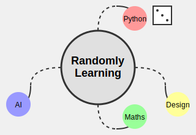

# Randomly Learning

A collection of random topics I come across. It builds on the ideas of [random walk](https://en.wikipedia.org/wiki/Random_walk), [interleaving](https://www.ncbi.nlm.nih.gov/pmc/articles/PMC4141442), and [generation effect](https://en.wikipedia.org/wiki/Generation_effect).

<kbd>
    
</kbd>

