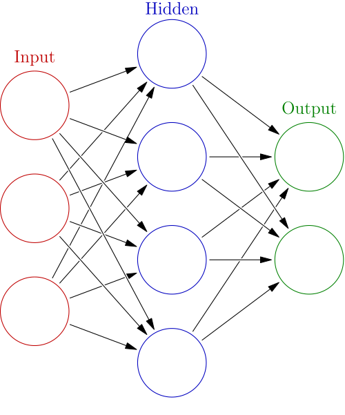

- A neural network (also `artificial neural network` or `neural net`, `ANN`, or `NN`) is a model inspired by the structure and function of biological neural networks in animal brains.
- An ANN consists of `nodes` (artificial neurons) connected by `edges`. The nodes model the neurons in a brain, while the edges model the synapses in a brain.
- Each neuron receives signals from connected neurons. It processes them and sends a signal to other connected neurons.
- The `activation function` is a non-linear function that calculates the output of the node based on its inputs and weights.
- `Weights` determine the strength of the input and they are "learned".

## References
- https://en.wikipedia.org/wiki/Neural_network_(machine_learning)
- https://en.wikipedia.org/wiki/Activation_function