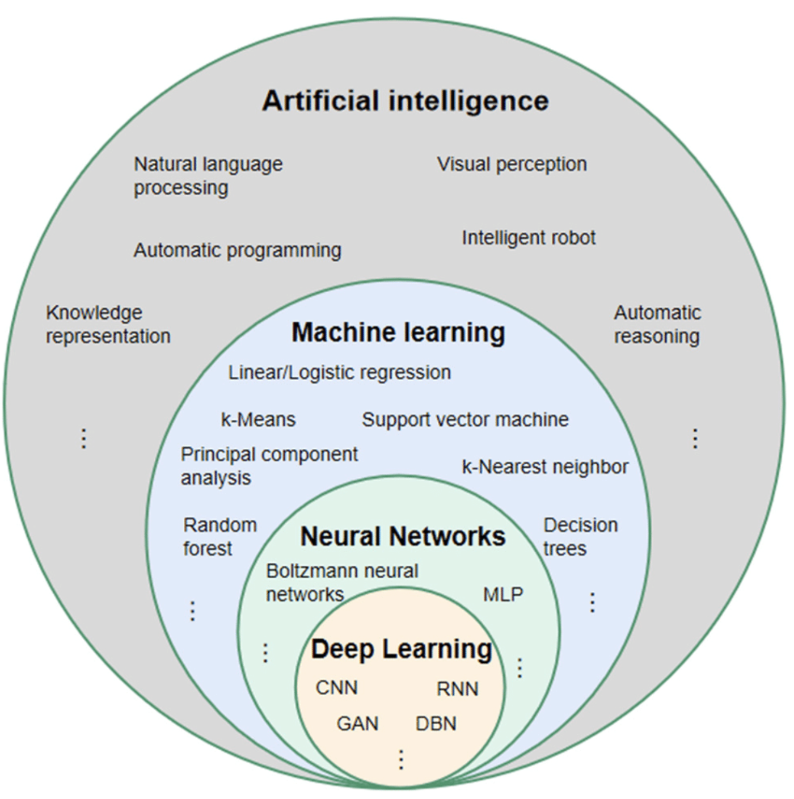
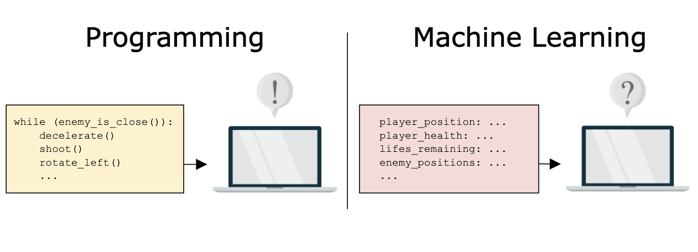

- Machine learning (ML) is a field of study in artificial intelligence concerned with the development and study of statistical algorithms that can learn from data and generalize to unseen data, and thus perform tasks without explicit instructions.
- Artificial neural networks have been able to surpass many previous approaches in performance.

## Supervised learning
- Supervised learning algorithms learn a function, through iterative optimisation of an objective function, which can predict the output given an input.
- For this they use training data containing input->output.
- Examples:
  - classification: for categorical outputs
  - regression: for numerical/continuous outputs

## Unsupervised learning
- Unsupervised learning algorithms find structures in data that has not been labeled, classified or categorized.
- Examples:
  - clustering
  - dimensionality reduction

## Semi-supervised learning
- It falls between unsupervised learning and supervised learning.
- Unlabeled data, when used in conjunction with a small amount of labeled data, can produce a considerable improvement in learning accuracy.

## Reinforcement learning
- Concerned with how software agents ought to take actions in an environment so as to maximize some notion of cumulative reward

## Feature learning
- Also called representation learning algorithms
- Similar to clustering and dimensionality reduction algorithms, these algorithms discover better representations of the inputs during training. However, in contrast to them, they preserve the information in their input and transform it in a way that makes it useful, often as a pre-processing step before performing classification or predictions. This way they don't need manual feature engineering.

## Traditional Programming vs Machine Learning
- Many if/else conditions and edge cases
- Many decisions to be made

## References
- https://en.wikipedia.org/wiki/Machine_learning
- https://www.researchgate.net/figure/Relationship-between-artificial-intelligence-machine-learning-neural-network-and-deep_fig3_354124420
- https://www.educative.io/courses/fundamentals-of-machine-learning-for-software-engineers